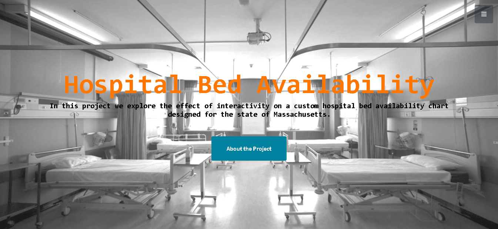
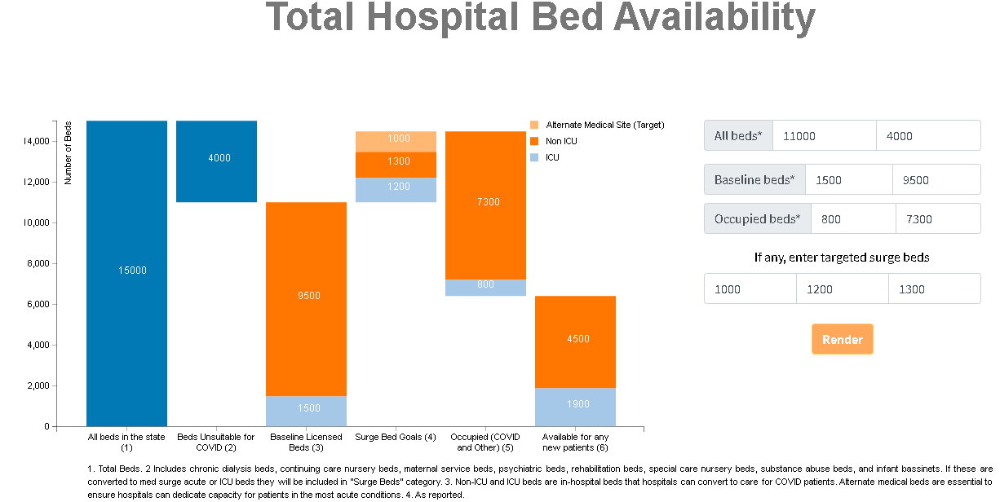

Data Visualization Final Project
===

Project Webpage: https://github.com/kimsta007/viz-final

Project Demo:

Project Process Book:

Project Background
===
For this project we critically analyse a visualization of the availability of hospital beds in the state of Massachusetts. The custom visualization shows the Total available beds, unsuitable beds, baseline licensed beds, surge beds, occupied and available beds for the state of Massachussets. It further splits the categories into ICU, Non ICU and Alternate Beds. This project will highlight the impact of interactivity in data visualization. As an alternative we propose an interactive visualization for conveying the same information. As a proposed solution we allow the audience to dynamically create a similar visualization based on the values they desire. The visualization uses tooltips for quick reference of the respective values. A validation mechanism is put in place to guard against incorrect values.

Design Tools
===
D3, HTML, CSS

Team Members
===
[1] Xiaoshuai (Maksim) Li (Data Science), Worcester Polytechnic Institute, Worcester, MA, USA. 
E-mail: xli3@wpi.edu

[2] Noëlle Rakotondravony (Computer Science), Worcester Polytechnic Institute, Worcester, MA, USA. 
E-mail: ntrakotondravony@wpi.edu

[3] Akim Ndlovu (Computer Science), Worcester Polytechnic Institute, Worcester, MA, USA. 
E-mail: andlovu@wpi.edu

References
===
[1] Benito, J., 2020. Stacked Bar Chart With Legend, Text Labels And Tooltips. [online] Github. Available at: <https://gist.github.com/cbjuan/43f10523858abf6053ae> [Accessed 11 May 2020].

[2] Blackrockdigital. 2020. Stylish Portfolio - Start Bootstrap Template. [online] Available at: <https://blackrockdigital.github.io/startbootstrap-stylish-portfolio/> [Accessed 11 May 2020].